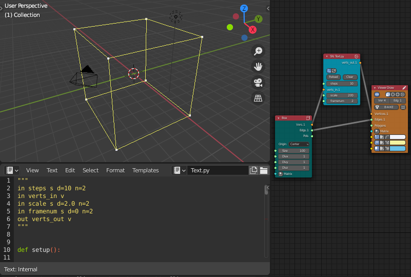

# Running external C code with SNLite

## Description

This project is an example of running external C code with Script Node Lite (SNLite) node of [Sverchok add-on](https://github.com/nortikin/sverchok) for [Blender](https://www.blender.org). You can also use this as a template, when you intend to run your own C/C++ codes in Blender.

This project idea is originated from [@zeffi's gist](https://gist.github.com/zeffii/9e156f0d37977fd1b0ca3c65d0ddc611) and [nortikin/sverchok#2152](https://github.com/nortikin/sverchok/issues/2152) .

## Usage

### Creating C library and modifying Python file
- Create C dynamic library in advance, from C file in the same directory.  
- Then, open Python file and replace 'load_library' args with your library name and path.  

### Opening Sverchok node editor
- Install Blender and Sverchok add-on.
- Enable the add-on with Menu->Edit->Preferences...-> add-ons.  
- Open sverchok node editor, and click '+New' button in the header.  

### Using SNLite node
- Press 'Shift-A' and select 'scripts'->'ScriptNodeLite'.  
- Open Blender's text editor, and copy and paste the Python script to the text area.  
- Change the text name from 'Text' to 'Text.py'.  
- Write 'Text.py' to the text box in SNLite node, and push the right button of the node.  
- Set the node parameters and input some vertices to the node.  
- After that, calculation run and you can use output data, changing 'framenum' parameter.  

## Other way to use
- Modify original script and C code for your own projects, especially for projects that require large amount of calculation and high performance.

#### Project Files
- scale_verts.py  
- scale_verts.c  

## Requirements
* Blender 2.8 (or later)
* sverchok add-on 0.6 (or later)

## Author
asahidari

## Licence
[GPL 3](https://www.gnu.org/licenses/quick-guide-gplv3.html)
